# 🗄️ DATABASE SCHEMA, ERD & DFD - SISTEM KOSTIN

**Dokumentasi Lengkap Database Architecture, Entity Relationship Diagram, dan Data Flow Diagram**

---

## 📋 DAFTAR ISI

1. [Database Architecture Overview](#database-architecture-overview)
2. [Database Schema (KV Store)](#database-schema-kv-store)
3. [Entity Relationship Diagram (ERD)](#entity-relationship-diagram-erd)
4. [Data Flow Diagram (DFD)](#data-flow-diagram-dfd)
5. [Key Patterns Reference](#key-patterns-reference)
6. [Data Structures](#data-structures)
7. [Database Operations](#database-operations)

---

## 🏗️ DATABASE ARCHITECTURE OVERVIEW

### **Database Type: Key-Value Store (KV Store)**

KostIn menggunakan **Supabase PostgreSQL** dengan **Key-Value Store pattern** untuk flexibility dan simplicity.

**Alasan KV Store:**
- ✅ **Flexible Schema** - Mudah add fields tanpa migration
- ✅ **Rapid Development** - Cocok untuk prototyping
- ✅ **Simple Queries** - Get/Set operations
- ✅ **NoSQL-like** - JSON storage dalam RDBMS
- ✅ **Scalable** - Horizontal scaling ready

**Trade-offs:**
- ❌ Complex joins sulit (mitigated dengan prefix queries)
- ❌ No foreign key constraints (handled di application layer)
- ❌ Indexing terbatas pada key (mitigated dengan composite keys)

---

## 📊 DATABASE SCHEMA (RELATIONAL)

### **Physical Schema**

The system uses a standard Relational Database Management System (PostgreSQL/MySQL) with the following tables:

#### 1️⃣ **users**
| Column | Type | Attributes | Description |
|---|---|---|---|
| `id` | BIGINT | PK, Auto Increment | |
| `name` | VARCHAR | Not Null | |
| `email` | VARCHAR | Unique, Not Null | |
| `phone` | VARCHAR | Nullable | |
| `role` | ENUM | Default 'tenant' | 'admin', 'owner', 'tenant' |
| `email_verified_at` | TIMESTAMP | Nullable | |
| `password` | VARCHAR | Not Null | |
| `google_id` | VARCHAR | Unique, Nullable | |
| `suspended_at` | TIMESTAMP | Nullable | |
| `remember_token` | VARCHAR | Nullable | |
| `created_at` | TIMESTAMP | | |
| `updated_at` | TIMESTAMP | | |

#### 2️⃣ **properties**
| Column | Type | Attributes | Description |
|---|---|---|---|
| `id` | BIGINT | PK, Auto Increment | |
| `owner_id` | BIGINT | FK -> users.id | Cascade on Delete |
| `name` | VARCHAR | Not Null | |
| `address` | VARCHAR | Not Null | |
| `lat` | DECIMAL(10,7) | Nullable | |
| `lng` | DECIMAL(10,7) | Nullable | |
| `rules_text` | TEXT | Nullable | |
| `photos` | JSON | Nullable | |
| `status` | ENUM | Default 'pending' | 'draft', 'pending', 'approved', 'rejected' |
| `moderation_notes` | TEXT | Nullable | |
| `moderated_by` | BIGINT | FK -> users.id | Nullable, Null on Delete |
| `moderated_at` | TIMESTAMP | Nullable | |
| `created_at` | TIMESTAMP | | |
| `updated_at` | TIMESTAMP | | |

#### 3️⃣ **room_types**
| Column | Type | Attributes | Description |
|---|---|---|---|
| `id` | BIGINT | PK, Auto Increment | |
| `property_id` | BIGINT | FK -> properties.id | Cascade on Delete |
| `name` | VARCHAR | Not Null | |
| `description` | TEXT | Nullable | |
| `area_m2` | INT UNSIGNED | Nullable | |
| `bathroom_type` | ENUM | Nullable | 'inside', 'outside' |
| `base_price` | INT UNSIGNED | Not Null | |
| `deposit` | INT UNSIGNED | Default 0 | |
| `facilities_json` | JSON | Nullable | |
| `created_at` | TIMESTAMP | | |
| `updated_at` | TIMESTAMP | | |

#### 4️⃣ **rooms**
| Column | Type | Attributes | Description |
|---|---|---|---|
| `id` | BIGINT | PK, Auto Increment | |
| `room_type_id` | BIGINT | FK -> room_types.id | Cascade on Delete |
| `room_code` | VARCHAR | Not Null | |
| `custom_price` | INT UNSIGNED | Nullable | |
| `status` | ENUM | Default 'available' | 'available', 'occupied', 'maintenance' |
| `description` | TEXT | Nullable | |
| `photos_json` | JSON | Nullable | |
| `facilities_override_json` | JSON | Nullable | |
| `created_at` | TIMESTAMP | | |
| `updated_at` | TIMESTAMP | | |

#### 5️⃣ **contracts**
| Column | Type | Attributes | Description |
|---|---|---|---|
| `id` | BIGINT | PK, Auto Increment | |
| `tenant_id` | BIGINT | FK -> users.id | Cascade on Delete |
| `room_id` | BIGINT | FK -> rooms.id | Cascade on Delete |
| `start_date` | DATE | Not Null | |
| `end_date` | DATE | Nullable | |
| `price_per_month` | INT UNSIGNED | Not Null | |
| `billing_day` | TINYINT UNSIGNED | Default 1 | |
| `deposit_amount` | INT UNSIGNED | Default 0 | |
| `grace_days` | TINYINT UNSIGNED | Default 3 | |
| `late_fee_per_day` | INT UNSIGNED | Default 0 | |
| `status` | ENUM | Default 'active' | 'draft', 'submitted', 'active', 'pending_renewal', 'terminated', 'canceled', 'expired' |
| `submitted_at` | TIMESTAMP | Nullable | |
| `activated_at` | TIMESTAMP | Nullable | |
| `terminated_at` | TIMESTAMP | Nullable | |
| `termination_reason` | TEXT | Nullable | |
| `created_at` | TIMESTAMP | | |
| `updated_at` | TIMESTAMP | | |

#### 6️⃣ **invoices**
| Column | Type | Attributes | Description |
|---|---|---|---|
| `id` | BIGINT | PK, Auto Increment | |
| `contract_id` | BIGINT | FK -> contracts.id | Cascade on Delete |
| `period_month` | SMALLINT UNSIGNED | Not Null | |
| `period_year` | SMALLINT UNSIGNED | Not Null | |
| `months_count` | TINYINT UNSIGNED | Default 1 | |
| `coverage_start_month` | TINYINT UNSIGNED | Nullable | |
| `coverage_start_year` | SMALLINT UNSIGNED | Nullable | |
| `coverage_end_month` | TINYINT UNSIGNED | Nullable | |
| `coverage_end_year` | SMALLINT UNSIGNED | Nullable | |
| `due_date` | DATE | Not Null | |
| `amount` | INT UNSIGNED | Not Null | |
| `late_fee` | INT UNSIGNED | Default 0 | |
| `total` | INT UNSIGNED | Not Null | |
| `status` | ENUM | Default 'unpaid' | 'unpaid', 'paid', 'overdue', 'canceled', 'pending_verification', 'expired' |
| `status_reason` | TEXT | Nullable | |
| `primary_payment_id` | BIGINT UNSIGNED | Nullable | |
| `external_order_id` | VARCHAR | Nullable | |
| `qris_payload` | JSON | Nullable | |
| `paid_at` | TIMESTAMP | Nullable | |
| `expires_at` | TIMESTAMP | Nullable | |
| `created_at` | TIMESTAMP | | |
| `updated_at` | TIMESTAMP | | |

#### 7️⃣ **payments**
| Column | Type | Attributes | Description |
|---|---|---|---|
| `id` | BIGINT | PK, Auto Increment | |
| `invoice_id` | BIGINT | FK -> invoices.id | Cascade on Delete |
| `user_id` | BIGINT | FK -> users.id | Nullable, Cascade on Delete |
| `submitted_by` | BIGINT | FK -> users.id | Nullable, Null on Delete |
| `midtrans_order_id` | VARCHAR | Nullable | Indexed |
| `order_id` | VARCHAR | Unique | |
| `transaction_id` | VARCHAR | Nullable | |
| `payment_type` | ENUM | Default 'qris' | 'qris', 'manual_bank_transfer', 'manual_cash' |
| `manual_method` | VARCHAR | Nullable | |
| `amount` | DECIMAL(15,2) | Not Null | |
| `status` | ENUM | Default 'pending' | 'pending', 'waiting_verification', 'success', 'failed', 'rejected' |
| `paid_at` | TIMESTAMP | Nullable | |
| `transaction_status` | VARCHAR | Nullable | |
| `qris_string` | TEXT | Nullable | |
| `va_numbers` | JSON | Nullable | |
| `midtrans_response` | JSON | Nullable | |
| `raw_webhook_json` | JSON | Nullable | |
| `proof_path` | VARCHAR | Nullable | |
| `proof_filename` | VARCHAR | Nullable | |
| `notes` | TEXT | Nullable | |
| `verified_by` | BIGINT | FK -> users.id | Nullable, Null on Delete |
| `verified_at` | TIMESTAMP | Nullable | |
| `rejection_reason` | TEXT | Nullable | |
| `settlement_time` | TIMESTAMP | Nullable | |
| `created_at` | TIMESTAMP | | |
| `updated_at` | TIMESTAMP | | |

#### 8️⃣ **wishlist_items**
| Column | Type | Attributes | Description |
|---|---|---|---|
| `id` | BIGINT | PK, Auto Increment | |
| `user_id` | BIGINT | FK -> users.id | Cascade on Delete |
| `property_id` | BIGINT | FK -> properties.id | Cascade on Delete |
| `created_at` | TIMESTAMP | | |
| `updated_at` | TIMESTAMP | | |

#### 9️⃣ **tickets**
| Column | Type | Attributes | Description |
|---|---|---|---|
| `id` | BIGINT | PK, Auto Increment | |
| `ticket_code` | VARCHAR | Unique | |
| `reporter_id` | BIGINT | FK -> users.id | Cascade on Delete |
| `assignee_id` | BIGINT | FK -> users.id | Nullable, Null on Delete |
| `subject` | VARCHAR | Not Null | |
| `description` | TEXT | Not Null | |
| `category` | ENUM | Not Null | 'technical', 'payment', 'content', 'abuse' |
| `priority` | ENUM | Default 'medium' | 'low', 'medium', 'high', 'urgent' |
| `status` | ENUM | Default 'open' | 'open', 'in_review', 'escalated', 'resolved', 'rejected' |
| `related_type` | VARCHAR | Nullable | Polymorphic |
| `related_id` | BIGINT | Nullable | Polymorphic |
| `tags` | JSON | Nullable | |
| `sla_minutes` | INT UNSIGNED | Nullable | |
| `closed_at` | TIMESTAMP | Nullable | |
| `escalated_at` | TIMESTAMP | Nullable | |
| `created_at` | TIMESTAMP | | |
| `updated_at` | TIMESTAMP | | |

#### 🔟 **ticket_comments**
| Column | Type | Attributes | Description |
|---|---|---|---|
| `id` | BIGINT | PK, Auto Increment | |
| `ticket_id` | BIGINT | FK -> tickets.id | Cascade on Delete |
| `user_id` | BIGINT | FK -> users.id | Cascade on Delete |
| `body` | TEXT | Not Null | |
| `attachments` | JSON | Nullable | |
| `created_at` | TIMESTAMP | | |
| `updated_at` | TIMESTAMP | | |

#### 1️⃣1️⃣ **ticket_events**
| Column | Type | Attributes | Description |
|---|---|---|---|
| `id` | BIGINT | PK, Auto Increment | |
| `ticket_id` | BIGINT | FK -> tickets.id | Cascade on Delete |
| `user_id` | BIGINT | FK -> users.id | Nullable, Null on Delete |
| `event_type` | ENUM | Not Null | 'created', 'status_changed', 'comment_added', 'assigned', 'escalated', 'resolved', 'reopened', 'rejected' |
| `payload` | JSON | Nullable | |
| `created_at` | TIMESTAMP | | |
| `updated_at` | TIMESTAMP | | |

#### 1️⃣2️⃣ **conversations**
| Column | Type | Attributes | Description |
|---|---|---|---|
| `id` | BIGINT | PK, Auto Increment | |
| `title` | VARCHAR | Nullable | |
| `is_group` | BOOLEAN | Default false | |
| `metadata` | JSON | Nullable | |
| `created_at` | TIMESTAMP | | |
| `updated_at` | TIMESTAMP | | |

#### 1️⃣3️⃣ **conversation_user**
| Column | Type | Attributes | Description |
|---|---|---|---|
| `id` | BIGINT | PK, Auto Increment | |
| `conversation_id` | BIGINT | FK -> conversations.id | Cascade on Delete |
| `user_id` | BIGINT | FK -> users.id | Cascade on Delete |
| `last_read_at` | TIMESTAMP | Nullable | |
| `role` | VARCHAR | Nullable | |
| `created_at` | TIMESTAMP | | |
| `updated_at` | TIMESTAMP | | |

#### 1️⃣4️⃣ **messages**
| Column | Type | Attributes | Description |
|---|---|---|---|
| `id` | BIGINT | PK, Auto Increment | |
| `conversation_id` | BIGINT | FK -> conversations.id | Cascade on Delete |
| `user_id` | BIGINT | FK -> users.id | Cascade on Delete |
| `body` | TEXT | Not Null | |
| `attachments` | JSON | Nullable | |
| `read_at` | TIMESTAMP | Nullable | |
| `created_at` | TIMESTAMP | | |
| `updated_at` | TIMESTAMP | | |

#### 1️⃣5️⃣ **rental_applications**
| Column | Type | Attributes | Description |
|---|---|---|---|
| `id` | BIGINT | PK, Auto Increment | |
| `tenant_id` | BIGINT | FK -> users.id | Cascade on Delete |
| `property_id` | BIGINT | FK -> properties.id | Cascade on Delete |
| `room_type_id` | BIGINT | FK -> room_types.id | Nullable, Null on Delete |
| `room_id` | BIGINT | FK -> rooms.id | Nullable, Null on Delete |
| `contact_phone` | VARCHAR | Nullable | |
| `contact_email` | VARCHAR | Nullable | |
| `preferred_start_date` | DATE | Nullable | |
| `duration_months` | INT UNSIGNED | Default 12 | |
| `occupants_count` | TINYINT UNSIGNED | Default 1 | |
| `budget_per_month` | BIGINT UNSIGNED | Nullable | |
| `employment_status` | VARCHAR | Nullable | |
| `company_name` | VARCHAR | Nullable | |
| `job_title` | VARCHAR | Nullable | |
| `monthly_income` | BIGINT UNSIGNED | Nullable | |
| `has_vehicle` | BOOLEAN | Default false | |
| `vehicle_notes` | VARCHAR | Nullable | |
| `emergency_contact_name` | VARCHAR | Nullable | |
| `emergency_contact_phone` | VARCHAR | Nullable | |
| `status` | VARCHAR | Default 'pending' | 'pending', 'approved', 'rejected', 'cancelled' |
| `tenant_notes` | TEXT | Nullable | |
| `owner_notes` | TEXT | Nullable | |
| `approved_at` | TIMESTAMP | Nullable | |
| `rejected_at` | TIMESTAMP | Nullable | |
| `terms_text` | TEXT | Nullable | |
| `terms_accepted_at` | TIMESTAMP | Nullable | |
| `created_at` | TIMESTAMP | | |
| `updated_at` | TIMESTAMP | | |

#### 1️⃣6️⃣ **owner_wallets**
| Column | Type | Attributes | Description |
|---|---|---|---|
| `id` | BIGINT | PK, Auto Increment | |
| `owner_id` | BIGINT | FK -> users.id | Unique, Cascade on Delete |
| `balance` | DECIMAL(15,2) | Default 0 | |
| `created_at` | TIMESTAMP | | |
| `updated_at` | TIMESTAMP | | |

#### 1️⃣7️⃣ **owner_wallet_transactions**
| Column | Type | Attributes | Description |
|---|---|---|---|
| `id` | BIGINT | PK, Auto Increment | |
| `owner_wallet_id` | BIGINT | FK -> owner_wallets.id | Cascade on Delete |
| `payment_id` | BIGINT | FK -> payments.id | Nullable, Null on Delete |
| `type` | ENUM | Not Null | 'credit', 'debit' |
| `amount` | DECIMAL(15,2) | Not Null | |
| `description` | VARCHAR | Nullable | |
| `metadata` | JSON | Nullable | |
| `created_at` | TIMESTAMP | | |
| `updated_at` | TIMESTAMP | | |

#### 1️⃣8️⃣ **contract_termination_requests**
| Column | Type | Attributes | Description |
|---|---|---|---|
| `id` | BIGINT | PK, Auto Increment | |
| `contract_id` | BIGINT | FK -> contracts.id | Cascade on Delete |
| `tenant_id` | BIGINT | FK -> users.id | Cascade on Delete |
| `requested_end_date` | DATE | Not Null | |
| `reason` | TEXT | Nullable | |
| `status` | ENUM | Default 'pending' | 'pending', 'approved', 'rejected' |
| `owner_notes` | TEXT | Nullable | |
| `resolved_at` | TIMESTAMP | Nullable | |
| `created_at` | TIMESTAMP | | |
| `updated_at` | TIMESTAMP | | |

---

### **Physical ERD (Mermaid)**

```mermaid
erDiagram
    USERS ||--o{ PROPERTIES : owns
    USERS ||--o{ CONTRACTS : "tenant of"
    USERS ||--o{ PAYMENTS : makes
    USERS ||--o{ WISHLIST_ITEMS : saves
    USERS ||--o{ TICKETS : reports
    USERS ||--o{ TICKET_COMMENTS : writes
    USERS ||--o{ CONVERSATION_USER : participates
    USERS ||--o{ MESSAGES : sends
    USERS ||--o{ RENTAL_APPLICATIONS : applies
    USERS ||--|| OWNER_WALLETS : has

    PROPERTIES ||--o{ ROOM_TYPES : has
    PROPERTIES ||--o{ RENTAL_APPLICATIONS : receives
    PROPERTIES ||--o{ WISHLIST_ITEMS : "is in"

    ROOM_TYPES ||--o{ ROOMS : defines
    ROOM_TYPES ||--o{ RENTAL_APPLICATIONS : "requested type"

    ROOMS ||--o{ CONTRACTS : "is rented in"
    ROOMS ||--o{ RENTAL_APPLICATIONS : "requested room"

    CONTRACTS ||--o{ INVOICES : generates
    CONTRACTS ||--o{ CONTRACT_TERMINATION_REQUESTS : "has requests"

    INVOICES ||--o{ PAYMENTS : "paid by"

    PAYMENTS ||--o{ OWNER_WALLET_TRANSACTIONS : "triggers"

    OWNER_WALLETS ||--o{ OWNER_WALLET_TRANSACTIONS : "has"

    TICKETS ||--o{ TICKET_COMMENTS : has
    TICKETS ||--o{ TICKET_EVENTS : has

    CONVERSATIONS ||--o{ CONVERSATION_USER : has
    CONVERSATIONS ||--o{ MESSAGES : contains

    USERS {
        bigint id PK
        string name
        string email
        string role
        string google_id
    }

    PROPERTIES {
        bigint id PK
        bigint owner_id FK
        string name
        string status
    }

    ROOM_TYPES {
        bigint id PK
        bigint property_id FK
        string name
        int base_price
    }

    ROOMS {
        bigint id PK
        bigint room_type_id FK
        string room_code
        string status
    }

    CONTRACTS {
        bigint id PK
        bigint tenant_id FK
        bigint room_id FK
        date start_date
        string status
    }

    INVOICES {
        bigint id PK
        bigint contract_id FK
        date due_date
        int amount
        string status
    }

    PAYMENTS {
        bigint id PK
        bigint invoice_id FK
        decimal amount
        string status
        string payment_type
    }

    WISHLIST_ITEMS {
        bigint id PK
        bigint user_id FK
        bigint property_id FK
    }

    TICKETS {
        bigint id PK
        bigint reporter_id FK
        string subject
        string status
    }

    CONVERSATIONS {
        bigint id PK
        boolean is_group
    }

    MESSAGES {
        bigint id PK
        bigint conversation_id FK
        bigint user_id FK
        text body
    }

    RENTAL_APPLICATIONS {
        bigint id PK
        bigint tenant_id FK
        bigint property_id FK
        string status
    }

    OWNER_WALLETS {
        bigint id PK
        bigint owner_id FK
        decimal balance
    }
```



---

## 🔗 ENTITY RELATIONSHIP DIAGRAM (ERD)

### **Conceptual ERD**

```
┌──────────────────────────────────────────────────────────────────────┐
│                         KOSTIN ERD                                   │
│                    (Logical Relationships)                           │
└──────────────────────────────────────────────────────────────────────┘

┌─────────────────┐
│      USER       │
│  (Auth Table)   │
├─────────────────┤
│ PK: id          │
│    email        │
│    password     │
│    metadata     │
│    - name       │
│    - role       │─────────┐
│    created_at   │         │
└────────┬────────┘         │
         │                  │
         │ 1                │
         │                  │
         │ owns             │ extends
         │                  │
         │ N                │ 1
         │                  │
         ▼                  ▼
┌─────────────────┐  ┌─────────────────┐
│    PROPERTY     │  │     PROFILE     │
├─────────────────┤  │   (KV Store)    │
│ PK: id          │  ├─────────────────┤
│ FK: ownerId     │  │ PK: userId      │
│    name         │  │    phone        │
│    address      │  │    address      │
│    city         │  │    updated_at   │
│    type         │  └─────────────────┘
│    price        │
│    rooms        │
│    status       │
│    created_at   │
└────────┬────────┘
         │
         │ 1
         │
         │ has
         │
         │ N
         │
         ▼
┌─────────────────┐
│    CONTRACT     │
├─────────────────┤
│ PK: id          │
│ FK: tenantId    │───────────┐
│ FK: ownerId     │           │
│ FK: propertyId  │           │
│    startDate    │           │ 1
│    endDate      │           │
│    monthlyRent  │           │ for
│    status       │           │
│    created_at   │           │ N
└────────┬────────┘           │
         │                    │
         │ 1                  ▼
         │              ┌─────────────────┐
         │ generates    │     INVOICE     │
         │              ├─────────────────┤
         │ N            │ PK: id          │
         │              │ FK: contractId  │
         └──────────────│ FK: tenantId    │
                        │ FK: ownerId     │
                        │    amount       │
                        │    dueDate      │
                        │    status       │
                        │    created_at   │
                        └────────┬────────┘
                                 │
                                 │ 1
                                 │
                                 │ paid by
                                 │
                                 │ 0..1
                                 │
                                 ▼
                        ┌─────────────────┐
                        │     PAYMENT     │
                        ├─────────────────┤
                        │ PK: id          │
                        │ FK: invoiceId   │
                        │    method       │
                        │    amount       │
                        │    status       │
                        │    proofUrl     │
                        │    paidAt       │
                        └─────────────────┘


┌─────────────────┐         ┌─────────────────┐
│      USER       │─────────│    WISHLIST     │
│                 │    N    │  (Many-to-Many) │
│                 │─────────│                 │
└────────┬────────┘         └────────┬────────┘
         │                           │
         │                           │ N
         │ N                         │
         │                           │
         │ saves                     │
         │                           │
         │                           │
         │                           │
         │                           │
         └───────────┬───────────────┘
                     │
                     │ M
                     │
                     ▼
            ┌─────────────────┐
            │    PROPERTY     │
            │                 │
            └─────────────────┘


┌─────────────────┐         ┌─────────────────┐
│      USER       │─────────│  SAVED SEARCH   │
│                 │    1    │                 │
│                 │─────────│                 │
└─────────────────┘    N    └─────────────────┘


┌─────────────────┐         ┌─────────────────┐
│      USER       │─────────│  CONVERSATION   │
│   (Tenant)      │    N    │                 │
│                 │─────────│                 │───────┐
└─────────────────┘         └────────┬────────┘       │
                                     │                 │
                                     │ 1               │ N
         ┌───────────────────────────┘                 │
         │                                             │
         │ has                                         │
         │                                             │
         │ N                                           │
         │                                             │
         ▼                                             │
┌─────────────────┐                                   │
│     MESSAGE     │                                   │
│                 │                                   │
└─────────────────┘                                   │
                                                      │
┌─────────────────┐                                  │
│      USER       │──────────────────────────────────┘
│   (Owner)       │    N
│                 │
└─────────────────┘


┌─────────────────┐         ┌─────────────────┐
│      USER       │─────────│     TICKET      │
│                 │    1    │                 │
│                 │─────────│                 │───────┐
└─────────────────┘    N    └─────────────────┘       │
                                                       │
                                                       │ handled by
┌─────────────────┐                                   │
│      USER       │───────────────────────────────────┘
│    (Admin)      │    N
│                 │
└─────────────────┘
```

---

### **Physical ERD (KV Store Implementation)**

```
┌──────────────────────────────────────────────────────────────────────┐
│                    PHYSICAL KV STORE SCHEMA                          │
│             (Key Patterns & Value Structures)                        │
└──────────────────────────────────────────────────────────────────────┘

┌────────────────────────────────────────────────────────────────────┐
│                    TABLE: kv_store_dbd6b95a                        │
├────────────────────────────────────────────────────────────────────┤
│  key (TEXT, PRIMARY KEY)     │  value (JSONB)                      │
├──────────────────────────────┼─────────────────────────────────────┤
│ profile:{userId}             │ { phone, address, ... }             │
│ property:{propertyId}        │ { name, owner, price, ... }         │
│ contract:{contractId}        │ { tenant, property, dates, ... }    │
│ invoice:{invoiceId}          │ { amount, dueDate, status, ... }    │
│ payment:{paymentId}          │ { method, amount, proof, ... }      │
│ wishlist:{userId}:{propId}   │ { timestamp, propertyData, ... }    │
│ saved-search:{userId}:{id}   │ { name, filters, notif, ... }       │
│ chat:conversation:{convId}   │ { participants, lastMsg, ... }      │
│ chat:message:{messageId}     │ { sender, content, timestamp }      │
│ ticket:{ticketId}            │ { reporter, subject, events, ... }  │
└──────────────────────────────┴─────────────────────────────────────┘

KEY PATTERNS:
─────────────
Single Entity:        {type}:{id}
User Relation:        {type}:{userId}:{relatedId}
Nested Relation:      {type}:{parentType}:{parentId}:{childId}
Status Filter:        {type}:status:{statusValue}
List/Index:           {type}:{category}:list
```

---

## 📊 DATA FLOW DIAGRAM (DFD)

### **DFD LEVEL 0 - Context Diagram**

```
┌──────────────────────────────────────────────────────────────────────┐
│                        CONTEXT DIAGRAM                               │
│                  (System Boundary & External Entities)               │
└──────────────────────────────────────────────────────────────────────┘


                    ┌─────────────────┐
                    │     GUEST       │
                    │   (Visitor)     │
                    └────────┬────────┘
                             │
                    Browse   │ Register
                    Search   │ Apply
                             │
                             ▼
    ┌──────────────────────────────────────────────────────┐
    │                                                      │
    │                  KOSTIN SYSTEM                       │
    │         (Property Management Platform)               │
    │                                                      │
    │  • User Management                                   │
    │  • Property Listing                                  │
    │  • Contract Management                               │
    │  • Payment Processing                                │
    │  • Communication                                     │
    │  • Support & Moderation                              │
    │                                                      │
    └──┬────────┬────────────┬────────────┬─────────┬────┘
       │        │            │            │         │
       │        │            │            │         │
       ▼        ▼            ▼            ▼         ▼
  ┌─────────┐ ┌────────┐ ┌────────┐ ┌────────┐ ┌────────┐
  │ TENANT  │ │ OWNER  │ │ ADMIN  │ │MIDTRANS│ │SUPABASE│
  │(Penyewa)│ │(Pemilik)│ │ (Sys)  │ │Payment │ │ Auth & │
  └─────────┘ └────────┘ └────────┘ │Gateway │ │Storage │
                                     └────────┘ └────────┘
      │            │           │
      │ Pay Rent   │ Add Prop  │ Moderate
      │ View Inv   │ Verify Pay│ Manage
      │ Chat       │ Chat      │ Users
      │ Report     │ Report    │ Reports
      │            │           │
      └────────────┴───────────┘
```

---

### **DFD LEVEL 1 - Major Processes**

```
┌──────────────────────────────────────────────────────────────────────┐
│                          DFD LEVEL 1                                 │
│                    (Major System Processes)                          │
└──────────────────────────────────────────────────────────────────────┘

LEGEND:
━━━━━  Data Flow
[  ]   External Entity
( )    Process
═════  Data Store


    [GUEST/USER]
         │
         │ Login/Register
         │
         ▼
    ┌─────────────────┐
    │  1.0            │      User Data
    │  USER           │─────────────▶ ═══════════════
    │  MANAGEMENT     │                 D1: Users
    │                 │◀─────────────  (Supabase Auth)
    └─────────────────┘                ═══════════════
         │
         │ Auth Token
         │
         ├────────────────────┬────────────────────┬────────────────────┐
         │                    │                    │                    │
         ▼                    ▼                    ▼                    ▼
    ┌─────────────┐     ┌─────────────┐     ┌─────────────┐     ┌─────────────┐
    │  2.0        │     │  3.0        │     │  4.0        │     │  5.0        │
    │  PROPERTY   │     │  CONTRACT   │     │  PAYMENT    │     │  CHAT       │
    │  MANAGEMENT │     │  MANAGEMENT │     │  PROCESSING │     │  SYSTEM     │
    │             │     │             │     │             │     │             │
    └──────┬──────┘     └──────┬──────┘     └──────┬──────┘     └──────┬──────┘
           │                   │                    │                   │
           │                   │                    │                   │
           ▼                   ▼                    ▼                   ▼
    ═══════════════     ═══════════════     ═══════════════     ═══════════════
      D2: Property        D3: Contract        D4: Invoice         D5: Message
      D6: Wishlist                            D7: Payment         D8: Convers.
    ═══════════════     ═══════════════     ═══════════════     ═══════════════
           │                   │                    │
           │                   │                    │ Payment Status
           │                   │                    │
           │                   │                    ▼
           │                   │              ┌─────────────┐
           │                   │              │ [MIDTRANS]  │
           │                   │              │  Payment    │
           │                   │              │  Gateway    │
           │                   │              └─────────────┘
           │                   │
           └───────────┬───────┴────────────────────┐
                       │                            │
                       ▼                            ▼
                 ┌─────────────┐            ┌─────────────┐
                 │  6.0        │            │  7.0        │
                 │  WISHLIST & │            │  TICKETING  │
                 │  SEARCH     │            │  SYSTEM     │
                 │             │            │             │
                 └──────┬──────┘            └──────┬──────┘
                        │                          │
                        ▼                          ▼
                 ═══════════════            ═══════════════
                   D9: Wishlist               D10: Ticket
                   D10: Saved                 D11: Event
                   Search
                 ═══════════════            ═══════════════
```

---

### **DFD LEVEL 2 - Detailed Processes**

#### **2.1 - Property Management Process**

```
┌──────────────────────────────────────────────────────────────────────┐
│                    DFD LEVEL 2: PROPERTY MANAGEMENT                  │
└──────────────────────────────────────────────────────────────────────┘

[OWNER]
   │
   │ Property Data
   │
   ▼
┌─────────────────┐
│  2.1            │      Property
│  CREATE         │─────────────▶ ═══════════════
│  PROPERTY       │                 D2: Property
│                 │                ═══════════════
└─────────────────┘                      │
   │                                     │
   │ PropertyId                          │
   │                                     ▼
   ▼                              ┌─────────────────┐
┌─────────────────┐               │  2.2            │
│ [ADMIN]         │◀──────────────│  MODERATE       │
│ Moderator       │   Review Req  │  PROPERTY       │
└─────────────────┘               │                 │
   │                              └─────────────────┘
   │ Approval/Rejection                  │
   │                                     │
   └─────────────────────────────────────┤
                                         │ Status Update
                                         │
                                         ▼
                                  ═══════════════
                                    D2: Property
                                  ═══════════════
                                         │
                                         │ Active Properties
                                         │
                                         ▼
                                  ┌─────────────────┐
                                  │  2.3            │
[TENANT]                          │  BROWSE         │
   │                              │  PROPERTIES     │
   │ Search/Filter                │                 │
   └─────────────────────────────▶└─────────────────┘
                                         │
                                         │ Property List
                                         │
                                         ▼
                                  ┌─────────────────┐
                                  │  2.4            │
                                  │  ADD TO         │
                                  │  WISHLIST       │
                                  │                 │
                                  └────────┬────────┘
                                           │
                                           │ Wishlist Data
                                           │
                                           ▼
                                    ═══════════════
                                      D6: Wishlist
                                    ═══════════════
```

---

#### **2.2 - Contract Management Process**

```
┌──────────────────────────────────────────────────────────────────────┐
│                   DFD LEVEL 2: CONTRACT MANAGEMENT                   │
└──────────────────────────────────────────────────────────────────────┘

[TENANT]
   │
   │ Application Data
   │ (Property, Room, Duration)
   │
   ▼
┌─────────────────┐
│  3.1            │      Application
│  APPLY          │─────────────▶ ═══════════════
│  RENTAL         │                 Temp Storage
│                 │                ═══════════════
└─────────────────┘                      │
   │                                     │
   │ ApplicationId                       │ Notify Owner
   │                                     │
   │                                     ▼
   │                              ┌─────────────────┐
   │                              │ [OWNER]         │
   │                              │ Reviews App     │
   │                              └────────┬────────┘
   │                                       │
   │                                       │ Approval
   │                                       │
   │                                       ▼
   │                              ┌─────────────────┐
   │                              │  3.2            │
   │                              │  CREATE         │
   │                              │  CONTRACT       │
   │                              │                 │
   │                              └────────┬────────┘
   │                                       │
   │                                       │ Contract Data
   │                                       │
   │                                       ▼
   │                                ═══════════════
   │                                  D3: Contract
   │                                ═══════════════
   │                                       │
   │                                       │ ContractId
   │                                       │
   │                                       ▼
   │                              ┌─────────────────┐
   │                              │  3.3            │
   │                              │  GENERATE       │
   └──────────────────────────────│  INVOICES       │
                                  │  (Monthly)      │
                                  └────────┬────────┘
                                           │
                                           │ Invoice Data
                                           │
                                           ▼
                                    ═══════════════
                                      D4: Invoice
                                    ═══════════════
```

---

#### **2.3 - Payment Processing**

```
┌──────────────────────────────────────────────────────────────────────┐
│                   DFD LEVEL 2: PAYMENT PROCESSING                    │
└──────────────────────────────────────────────────────────────────────┘

[TENANT]
   │
   │ Pay Invoice
   │
   ├──────────────────────────┬────────────────────────┐
   │                          │                        │
   │ QRIS                     │ Manual                 │ Manual Upload
   │                          │                        │
   ▼                          ▼                        ▼
┌─────────────────┐    ┌─────────────────┐    ┌─────────────────┐
│  4.1            │    │  4.2            │    │  4.3            │
│  CREATE QRIS    │    │  UPLOAD         │    │  UPLOAD TO      │
│  TRANSACTION    │    │  PROOF          │    │  STORAGE        │
│                 │    │                 │    │  (Supabase)     │
└────────┬────────┘    └────────┬────────┘    └────────┬────────┘
         │                      │                       │
         │ Order Data           │ Proof File            │ File URL
         │                      │                       │
         ▼                      ▼                       ▼
  ┌─────────────┐      ┌─────────────────┐     ═══════════════
  │ [MIDTRANS]  │      │  4.4            │       D12: Storage
  │  Core API   │      │  SAVE PAYMENT   │     ═══════════════
  │             │      │  RECORD         │
  └──────┬──────┘      └────────┬────────┘
         │                      │
         │ QRIS String          │ Payment Data
         │ Transaction ID       │
         │                      ▼
         ▼               ═══════════════
┌─────────────────┐       D7: Payment
│  4.5            │     ═══════════════
│  DISPLAY QR     │            │
│  CODE           │            │ Notify
└─────────────────┘            │
         │                     ▼
         │              ┌─────────────────┐
         │ User Scans   │ [OWNER/ADMIN]   │
         │              │ Verifies        │
         ▼              └────────┬────────┘
┌─────────────────┐             │
│  4.6            │             │ Approve/Reject
│  AUTO-DETECT    │             │
│  PAYMENT        │             ▼
│  (Polling 3s)   │      ┌─────────────────┐
└────────┬────────┘      │  4.7            │
         │               │  UPDATE         │
         │ Status        │  INVOICE        │
         │ Settlement    │  STATUS         │
         │               │                 │
         └───────────────▶└────────┬────────┘
                                   │
                                   │ Update Status
                                   │
                                   ▼
                            ═══════════════
                              D4: Invoice
                            ═══════════════
```

---

#### **2.4 - Chat System**

```
┌──────────────────────────────────────────────────────────────────────┐
│                      DFD LEVEL 2: CHAT SYSTEM                        │
└──────────────────────────────────────────────────────────────────────┘

[TENANT]                                                    [OWNER]
   │                                                           │
   │ Start Chat                                                │
   │ About Property                                            │
   │                                                           │
   ├───────────────────────────┬───────────────────────────────┤
   │                           │                               │
   ▼                           ▼                               ▼
┌─────────────────┐     ┌─────────────────┐          ┌─────────────────┐
│  5.1            │     │  5.2            │          │  5.3            │
│  CREATE/FIND    │────▶│  LOAD           │◀─────────│  JOIN           │
│  CONVERSATION   │     │  CONVERSATION   │          │  CONVERSATION   │
│                 │     │                 │          │                 │
└─────────────────┘     └────────┬────────┘          └─────────────────┘
         │                       │
         │                       │ Conversation Data
         │                       │
         ▼                       ▼
  ═══════════════         ═══════════════
    D8: Convers.            D5: Message
  ═══════════════         ═══════════════
         │                       │
         │                       │
         └───────────┬───────────┘
                     │
                     │ Messages
                     │
                     ▼
            ┌─────────────────┐
            │  5.4            │
            │  DISPLAY        │
            │  MESSAGES       │
            │                 │
            └────────┬────────┘
                     │
[TENANT/OWNER]       │ Type Message
   │                 │
   │ Send Message    │
   │                 │
   └────────────────▶▼
            ┌─────────────────┐
            │  5.5            │      Message Data
            │  SEND           │────────────────▶ ═══════════════
            │  MESSAGE        │                   D5: Message
            │                 │                 ═══════════════
            └────────┬────────┘                        │
                     │                                 │
                     │                                 │ Update Last Msg
                     │                                 │
                     └─────────────────────────────────┤
                                                       │
                                                       ▼
                                                ═══════════════
                                                  D8: Convers.
                                                ═══════════════
                                                       │
                                                       │ Notify
                                                       │
                                                       ▼
                                                [OTHER USER]
```

---

#### **2.5 - Ticketing System**

```
┌──────────────────────────────────────────────────────────────────────┐
│                    DFD LEVEL 2: TICKETING SYSTEM                     │
└──────────────────────────────────────────────────────────────────────┘

[TENANT/OWNER]
   │
   │ Report Issue
   │
   ▼
┌─────────────────┐
│  7.1            │      Ticket Data
│  CREATE         │─────────────────▶ ═══════════════
│  TICKET         │                     D10: Ticket
│                 │                   ═══════════════
└─────────────────┘                          │
   │                                         │
   │ TicketId                                │ Notify Admin
   │                                         │
   │                                         ▼
   │                                  ┌─────────────────┐
   │                                  │ [ADMIN]         │
   │                                  │ Review Queue    │
   │                                  └────────┬────────┘
   │                                           │
   │                                           │ Select Ticket
   │                                           │
   │                                           ▼
   │                                  ┌─────────────────┐
   │                                  │  7.2            │
   │                                  │  REVIEW         │
   │                                  │  TICKET         │
   │                                  │                 │
   │                                  └────────┬────────┘
   │                                           │
   │                                           │ Action
   │                                           │
   ├───────────────────────────────────────────┤
   │                                           │
   │ Add Comment                               │ Change Status
   │                                           │ Add Comment
   ▼                                           ▼
┌─────────────────┐                    ┌─────────────────┐
│  7.3            │      Event         │  7.4            │     Event
│  ADD COMMENT    │─────────────────▶  │  UPDATE         │──────────▶
│                 │                    │  STATUS         │
│                 │                    │                 │
└─────────────────┘                    └─────────────────┘
         │                                     │
         │                                     │
         └─────────────────┬───────────────────┘
                           │
                           │ Event Data
                           │
                           ▼
                    ═══════════════
                      D10: Ticket
                      D11: Event
                    ═══════════════
                           │
                           │ Notification
                           │
                           ▼
                    [TICKET OWNER]
```

---

## 🔑 KEY PATTERNS REFERENCE

### **Complete Key Pattern Catalog**

```typescript
// ==========================================
// USER & PROFILE
// ==========================================
profile:{userId}                              // User profile data
profile:tenant:{tenantId}                     // Tenant-specific data
profile:owner:{ownerId}                       // Owner-specific data

// ==========================================
// PROPERTY
// ==========================================
property:{propertyId}                         // Property detail
property:owner:{ownerId}                      // List by owner
property:city:{city}                          // List by city
property:status:active                        // Active properties
property:status:pending_approval              // Pending moderation
property:type:{type}                          // Filter by type

// ==========================================
// CONTRACT
// ==========================================
contract:{contractId}                         // Contract detail
contract:tenant:{tenantId}                    // Contracts by tenant
contract:owner:{ownerId}                      // Contracts by owner
contract:property:{propertyId}                // Contracts by property
contract:status:active                        // Active contracts
contract:status:expired                       // Expired contracts

// ==========================================
// INVOICE
// ==========================================
invoice:{invoiceId}                           // Invoice detail
invoice:tenant:{tenantId}                     // Invoices by tenant
invoice:owner:{ownerId}                       // Invoices by owner
invoice:contract:{contractId}                 // Invoices by contract
invoice:status:pending                        // Pending invoices
invoice:status:paid                           // Paid invoices
invoice:status:overdue                        // Overdue invoices
invoice:month:{year}-{month}                  // Invoices by month

// ==========================================
// PAYMENT
// ==========================================
payment:{paymentId}                           // Payment detail
payment:invoice:{invoiceId}                   // Payment for invoice
payment:tenant:{tenantId}                     // Payments by tenant
payment:type:qris                             // QRIS payments
payment:type:manual                           // Manual payments
payment:status:pending                        // Pending payments
payment:status:success                        // Successful payments
payment:midtrans:{orderId}                    // Payment by Midtrans order

// ==========================================
// WISHLIST
// ==========================================
wishlist:{userId}:{propertyId}                // User wishlist item
wishlist:{userId}:*                           // All wishlists (prefix)

// ==========================================
// SAVED SEARCH
// ==========================================
saved-search:{userId}:{searchId}              // Saved search
saved-search:{userId}:*                       // All saved searches

// ==========================================
// CHAT
// ==========================================
chat:conversation:{conversationId}            // Conversation detail
chat:user:{userId}:conversations              // User conversations list
chat:property:{propertyId}:conversations      // Property chats
chat:message:{messageId}                      // Message detail
chat:conversation:{convId}:messages           // Messages in conversation

// ==========================================
// TICKET
// ==========================================
ticket:{ticketId}                             // Ticket detail
ticket:reporter:{reporterId}                  // Tickets by reporter
ticket:status:{status}                        // Tickets by status
ticket:category:{category}                    // Tickets by category
ticket:priority:{priority}                    // Tickets by priority
ticket:assigned:{adminId}                     // Tickets assigned to admin

// ==========================================
// ADMIN & SYSTEM
// ==========================================
owner-upgrade:{userId}                        // Owner upgrade record
demo-user:{email}                             // Demo user flag
system:config                                 // System configuration
system:stats                                  // System statistics
```

---

## 📦 DATA STRUCTURES

### **Complete JSON Schemas**

Sudah dijelaskan lengkap di section **Database Schema (KV Store)** di atas untuk:
- ✅ User/Profile
- ✅ Property
- ✅ Contract
- ✅ Invoice
- ✅ Payment
- ✅ Wishlist
- ✅ Saved Search
- ✅ Chat (Conversation & Message)
- ✅ Ticket

---

## 🔧 DATABASE OPERATIONS

### **KV Store Operations**

**Available Functions:**
```typescript
// Single operations
await kv.get(key)           // Get single value
await kv.set(key, value)    // Set/Update value
await kv.del(key)           // Delete key

// Multiple operations
await kv.mget([key1, key2])         // Get multiple
await kv.mset([key1, key2], [v1, v2]) // Set multiple
await kv.mdel([key1, key2])         // Delete multiple

// Prefix operations
await kv.getByPrefix('wishlist:user123:')  // Get all matching prefix
```

---

### **Common Query Patterns**

#### **1. Get User Profile**
```typescript
const profile = await kv.get(`profile:${userId}`);
```

#### **2. List All Properties by Owner**
```typescript
const properties = await kv.getByPrefix(`property:owner:${ownerId}:`);
```

#### **3. List Pending Invoices for Tenant**
```typescript
// Get all tenant invoices
const allInvoices = await kv.getByPrefix(`invoice:tenant:${tenantId}:`);

// Filter for pending
const pending = allInvoices.filter(inv => inv.status === 'pending');
```

#### **4. Get Active Contract**
```typescript
const contracts = await kv.getByPrefix(`contract:tenant:${tenantId}:`);
const active = contracts.find(c => c.status === 'active');
```

#### **5. Get Conversation Messages**
```typescript
const messages = await kv.getByPrefix(`chat:conversation:${convId}:messages:`);
// Sort by timestamp
messages.sort((a, b) => new Date(a.timestamp) - new Date(b.timestamp));
```

#### **6. Get User Wishlist**
```typescript
const wishlists = await kv.getByPrefix(`wishlist:${userId}:`);
```

#### **7. List Tickets by Status**
```typescript
const tickets = await kv.getByPrefix(`ticket:status:${status}:`);
```

---

### **Indexing Strategy**

**Primary Index:** Key (TEXT) with B-tree
**Secondary Index:** Key prefix for pattern matching

**Optimization Tips:**
- ✅ Use composite keys untuk common queries
- ✅ Prefix-based listing instead of full table scan
- ✅ Denormalize data untuk reduce lookups
- ✅ Cache frequently accessed data di frontend
- ✅ Batch operations dengan mget/mset

---

## 🔐 DATA INTEGRITY

### **Application-Level Constraints**

Karena KV Store tidak enforce foreign keys, validation dilakukan di application layer:

**1. Referential Integrity:**
```typescript
// Before deleting property, check contracts
const contracts = await kv.getByPrefix(`contract:property:${propertyId}:`);
if (contracts.length > 0) {
  throw new Error("Cannot delete property with active contracts");
}
```

**2. Unique Constraints:**
```typescript
// Check duplicate before insert
const existing = await kv.get(`property:${propertyId}`);
if (existing) {
  throw new Error("Property already exists");
}
```

**3. Required Fields:**
```typescript
// Validate required fields
if (!property.name || !property.ownerId || !property.price) {
  throw new Error("Missing required fields");
}
```

---

## 📈 SCALABILITY CONSIDERATIONS

### **Current Setup:**
- Single KV Store table
- Prefix-based partitioning
- JSON flexible schema

### **Future Scaling Options:**

**1. Add Indexes:**
```sql
CREATE INDEX idx_kv_value_status ON kv_store_dbd6b95a 
  ((value->>'status'));

CREATE INDEX idx_kv_value_owner ON kv_store_dbd6b95a 
  ((value->>'ownerId'));
```

**2. Table Partitioning:**
```sql
-- Partition by key prefix
CREATE TABLE kv_property PARTITION OF kv_store_dbd6b95a
  FOR VALUES FROM ('property:') TO ('property;');
```

**3. Caching Layer:**
- Redis for hot data
- In-memory cache for sessions
- CDN for static assets

**4. Read Replicas:**
- Separate read/write connections
- Load balancing across replicas

---

## 📊 DATABASE STATISTICS

**Estimated Storage per Entity:**
- User Profile: ~500 bytes
- Property: ~2 KB
- Contract: ~1.5 KB
- Invoice: ~800 bytes
- Payment: ~1 KB
- Message: ~500 bytes
- Ticket: ~2 KB (with events)

**Example Capacity (1GB Database):**
- ~2M user profiles
- ~500K properties
- ~1M invoices
- ~2M messages

---

## 🔄 MIGRATION STRATEGY

### **From KV to Relational (Future)**

If scaling requires relational DB:

**1. Create normalized tables**
**2. Migrate data with ETL script**
**3. Dual-write during transition**
**4. Cutover when verified**

**Migration Script Example:**
```typescript
// Read from KV
const properties = await kv.getByPrefix('property:');

// Write to relational
for (const prop of properties) {
  await db.property.create({
    data: {
      id: prop.id,
      ownerId: prop.ownerId,
      name: prop.name,
      // ... other fields
    }
  });
}
```

---

## 📚 DOCUMENTATION REFERENCES

**Related Docs:**
- [Complete System Documentation](./COMPLETE_SYSTEM_DOCUMENTATION.md)
- [Midtrans Setup](./MIDTRANS_SETUP.md)
- [Quick Start Guide](./QUICK_START_DEVELOPER.md)

**External Resources:**
- [Supabase Docs](https://supabase.com/docs)
- [PostgreSQL JSONB](https://www.postgresql.org/docs/current/datatype-json.html)
- [Key-Value Design Patterns](https://redis.io/docs/manual/patterns/)

---

**Last Updated:** November 4, 2024  
**Version:** 1.0  
**Database:** Supabase PostgreSQL + KV Store Pattern
