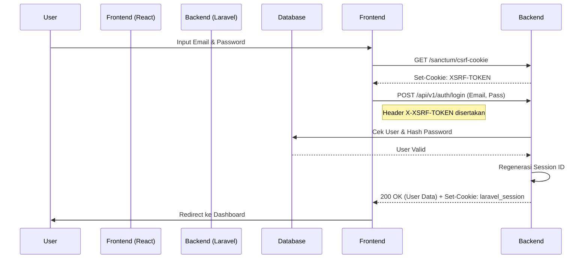

# Sistem Otentikasi (Authentication)

## Ringkasan
Sistem otentikasi Kostin dibangun di atas **Laravel Sanctum**. Kami menggunakan konfigurasi **Stateful** untuk SPA (Single Page Application). Ini adalah metode yang paling aman untuk aplikasi web karena menggunakan cookie `HttpOnly` yang tidak bisa dibaca oleh JavaScript, sehingga kebal terhadap pencurian token (XSS).

---

## 1. Alur Login (Login Flow)

Proses masuk ke dalam aplikasi melibatkan beberapa langkah keamanan untuk memastikan identitas pengguna.

### Visualisasi Alur

### Langkah-langkah:
1.  **Inisialisasi CSRF (Handshake)**
    *   **Aksi**: Frontend mengirim request `GET` ke `/sanctum/csrf-cookie`.
    *   **Tujuan**: Mengambil cookie `XSRF-TOKEN`.
    *   **Mekanisme**: Browser otomatis menyimpan cookie ini. Library Axios akan membaca nilai token ini dan menyertakannya di header `X-XSRF-TOKEN` pada setiap request berikutnya. Ini mencegah serangan CSRF (Cross-Site Request Forgery).

2.  **Pengiriman Kredensial**
    *   **Aksi**: Frontend mengirim `POST` ke `/api/v1/auth/login` dengan `email` dan `password`.
    *   **Validasi Backend**:
        *   Cek apakah email ada di database.
        *   Cek apakah password cocok (menggunakan Hash Bcrypt).
        *   Cek apakah akun sedang disuspend (`suspended_at` tidak null).

3.  **Regenerasi Sesi (Session Fixation Protection)**
    *   **Aksi**: Jika valid, Laravel menghancurkan ID sesi lama dan membuat ID sesi baru.
    *   **Tujuan**: Mencegah serangan Session Fixation.

4.  **Respons**
    *   **Backend**: Mengembalikan JSON berisi data user (`id`, `name`, `role`, `avatar`).
    *   **Browser**: Menerima cookie `laravel_session` (HttpOnly). Cookie ini adalah "tiket" masuk user untuk request selanjutnya.

---

## 2. Alur Registrasi (Registration Flow)

Proses pendaftaran pengguna baru.

### Langkah-langkah:
1.  **Input Data**
    *   **Aksi**: User mengisi Nama, Email, Password, dan memilih Role (Penyewa/Pemilik).
    *   **Validasi Frontend**: Memastikan password minimal 8 karakter dan email valid.

2.  **Proses Backend**
    *   **Endpoint**: `POST /api/v1/auth/register`.
    *   **Validasi**: Cek apakah email sudah terdaftar (Unique).
    *   **Pembuatan User**:
        *   Password di-hash.
        *   User disimpan ke tabel `users`.
        *   Role diset sesuai pilihan (default `tenant` jika kosong).

3.  **Auto-Login**
    *   **Aksi**: Setelah sukses dibuat, sistem otomatis meloginkan user tersebut (membuat sesi) sehingga user tidak perlu input email/password lagi.

---

## 3. Alur Lupa Password (Password Reset Flow)

Fitur krusial jika user kehilangan akses ke akunnya.

### Tahap 1: Permintaan Link
1.  **Input Email**: User memasukkan email di halaman "Lupa Password".
2.  **Request**: Frontend mengirim `POST` ke `/api/v1/auth/forgot-password`.
3.  **Backend**:
    *   Mencari user dengan email tersebut.
    *   Membuat **Token** unik dan menyimpannya di tabel `password_reset_tokens`.
    *   Mengirim **Email** ke user berisi link khusus: `https://kostin.web.id/reset-password?token=xyz&email=abc@mail.com`.

### Tahap 2: Reset Password
1.  **Klik Link**: User mengklik link di email dan diarahkan ke halaman Frontend "Reset Password".
2.  **Input Baru**: User memasukkan Password Baru dan Konfirmasi Password.
3.  **Eksekusi**: Frontend mengirim `POST` ke `/api/v1/auth/reset-password` dengan data: `token`, `email`, `password`.
4.  **Verifikasi Backend**:
    *   Cek kecocokan Token dan Email di tabel `password_reset_tokens`.
    *   Cek apakah token sudah kadaluarsa (biasanya 60 menit).
5.  **Update**: Jika valid, password user di tabel `users` diupdate dengan password baru yang sudah di-hash. Token dihapus agar tidak bisa dipakai lagi.

---

## 4. Middleware (Penjaga Akses)

Middleware berfungsi sebagai "satpam" yang mengecek setiap request sebelum sampai ke Controller.

### `auth:sanctum`
*   **Logika**: Mengecek keberadaan dan validitas cookie `laravel_session`.
*   **Gagal**: Jika cookie tidak ada atau sesi habis, kembalikan `401 Unauthorized`. Frontend akan merespons ini dengan melempar user ke halaman Login.

### `role:{nama_role}`
*   **Logika**: Mengecek kolom `role` pada user yang sedang login.
*   **Contoh**: Middleware `role:owner` hanya mengizinkan user dengan `role = 'owner'`.
*   **Gagal**: Jika `tenant` mencoba akses halaman `owner`, kembalikan `403 Forbidden`.

---

## 5. Daftar Controller Otentikasi

| Fitur | Controller | Lokasi File |
|-------|------------|-------------|
| **Login & Register** | `AuthController` | `app/Http/Controllers/Api/V1/AuthController.php` |
| **Kirim Link Reset** | `ForgotPasswordController` | `app/Http/Controllers/Api/V1/Auth/ForgotPasswordController.php` |
| **Ubah Password** | `ResetPasswordController` | `app/Http/Controllers/Api/V1/Auth/ResetPasswordController.php` |
