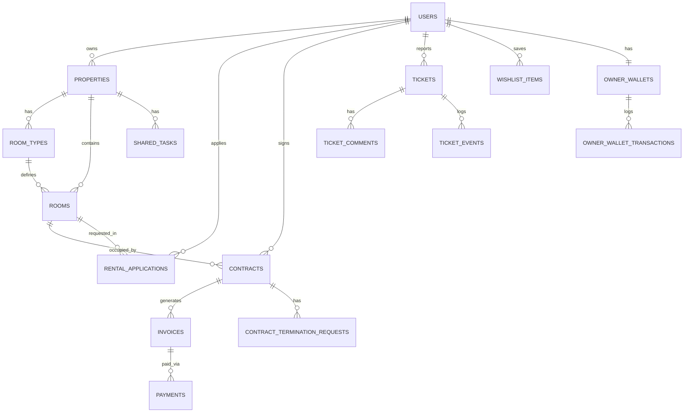

# Skema Database (Database Schema)

Dokumen ini menjelaskan struktur database aplikasi Kostin secara rinci, mencakup seluruh tabel yang ada dalam sistem.

## Diagram Relasi Entitas (ERD)

Berikut adalah visualisasi hubungan antar tabel utama dalam database Kostin.

---

## 1. Otentikasi & Pengguna (Auth & Users)

### `users`
Tabel utama untuk menyimpan data pengguna aplikasi.
| Kolom | Tipe Data | Deskripsi |
|-------|-----------|-----------|
| `id` | BIGINT (PK) | Primary Key. |
| `name` | STRING | Nama lengkap pengguna. |
| `email` | STRING | Alamat email (Unik). |
| `phone` | STRING | Nomor telepon (Opsional). |
| `role` | ENUM | Peran: `'admin'`, `'owner'`, `'tenant'`. |
| `password` | STRING | Password terenkripsi (Bcrypt). |
| `google_id` | STRING | ID akun Google (jika login via Google). |
| `suspended_at` | TIMESTAMP | Waktu pengguna diblokir (jika ada). |

### `password_reset_tokens`
Menyimpan token untuk fitur lupa password.
| Kolom | Tipe Data | Deskripsi |
|-------|-----------|-----------|
| `email` | STRING (PK) | Email pengguna. |
| `token` | STRING | Token verifikasi. |
| `created_at` | TIMESTAMP | Waktu pembuatan token. |

### `sessions`
Menyimpan sesi pengguna aktif (jika driver database digunakan).
| Kolom | Tipe Data | Deskripsi |
|-------|-----------|-----------|
| `id` | STRING (PK) | ID Sesi. |
| `user_id` | BIGINT | ID User pemilik sesi. |
| `payload` | LONGTEXT | Data sesi terenkripsi. |
| `last_activity` | INTEGER | Timestamp aktivitas terakhir. |

### `personal_access_tokens`
Menyimpan token API (Sanctum) untuk akses mobile/eksternal.
| Kolom | Tipe Data | Deskripsi |
|-------|-----------|-----------|
| `tokenable_id` | BIGINT | ID User pemilik token. |
| `name` | STRING | Nama token. |
| `token` | STRING | Hash token SHA-256. |
| `abilities` | JSON | Hak akses token. |

---

## 2. Manajemen Properti (Property Management)

### `properties`
Menyimpan data rumah kost.
| Kolom | Tipe Data | Relasi | Deskripsi |
|-------|-----------|--------|-----------|
| `id` | BIGINT (PK) | - | Primary Key. |
| `owner_id` | BIGINT | `users.id` | Pemilik kost. |
| `name` | STRING | - | Nama kost. |
| `address` | STRING | - | Alamat lengkap. |
| `lat`, `lng` | DECIMAL | - | Koordinat lokasi. |
| `rules_text` | TEXT | - | Peraturan kost. |
| `photos` | JSON | - | Array URL foto-foto kost. |
| `status` | ENUM | - | `'draft'`, `'pending'`, `'approved'`, `'rejected'`. |

### `room_types`
Kategori atau tipe kamar.
| Kolom | Tipe Data | Relasi | Deskripsi |
|-------|-----------|--------|-----------|
| `id` | BIGINT (PK) | - | Primary Key. |
| `property_id` | BIGINT | `properties.id` | Kost induk. |
| `name` | STRING | - | Nama tipe. |
| `price` | INTEGER | - | Harga dasar. |
| `facilities` | JSON | - | Daftar fasilitas. |
| `description` | TEXT | - | Deskripsi tipe kamar. |

### `rooms`
Unit kamar fisik.
| Kolom | Tipe Data | Relasi | Deskripsi |
|-------|-----------|--------|-----------|
| `id` | BIGINT (PK) | - | Primary Key. |
| `property_id` | BIGINT | `properties.id` | Kost induk. |
| `room_type_id` | BIGINT | `room_types.id` | Jenis kamar. |
| `name` | STRING | - | Nomor kamar. |
| `status` | ENUM | - | `'available'`, `'occupied'`, `'maintenance'`. |
| `description` | TEXT | - | Deskripsi khusus kamar (opsional). |

### `wishlist_items`
Daftar kost favorit tenant.
| Kolom | Tipe Data | Relasi | Deskripsi |
|-------|-----------|--------|-----------|
| `user_id` | BIGINT | `users.id` | Tenant. |
| `property_id` | BIGINT | `properties.id` | Kost favorit. |

---

## 3. Penyewaan (Tenancy)

### `rental_applications`
Permohonan sewa dari calon penyewa.
| Kolom | Tipe Data | Relasi | Deskripsi |
|-------|-----------|--------|-----------|
| `id` | BIGINT (PK) | - | Primary Key. |
| `tenant_id` | BIGINT | `users.id` | Pemohon. |
| `room_id` | BIGINT | `rooms.id` | Kamar yang diinginkan. |
| `status` | ENUM | - | `'pending'`, `'approved'`, `'rejected'`, `'canceled'`. |

### `contracts`
Perjanjian sewa aktif.
| Kolom | Tipe Data | Relasi | Deskripsi |
|-------|-----------|--------|-----------|
| `id` | BIGINT (PK) | - | Primary Key. |
| `tenant_id` | BIGINT | `users.id` | Penyewa. |
| `room_id` | BIGINT | `rooms.id` | Kamar. |
| `start_date` | DATE | - | Mulai sewa. |
| `end_date` | DATE | - | Selesai sewa. |
| `price_per_month` | INTEGER | - | Harga sewa. |
| `status` | ENUM | - | `'active'`, `'terminated'`, `'canceled'`, `'expired'`. |

### `contract_termination_requests`
Permohonan pemutusan kontrak lebih awal.
| Kolom | Tipe Data | Relasi | Deskripsi |
|-------|-----------|--------|-----------|
| `contract_id` | BIGINT | `contracts.id` | Kontrak terkait. |
| `tenant_id` | BIGINT | `users.id` | Pemohon. |
| `reason` | TEXT | - | Alasan berhenti sewa. |
| `status` | ENUM | - | `'pending'`, `'approved'`, `'rejected'`. |

---

## 4. Keuangan (Finance)

### `invoices`
Tagihan sewa bulanan.
| Kolom | Tipe Data | Relasi | Deskripsi |
|-------|-----------|--------|-----------|
| `id` | BIGINT (PK) | - | Primary Key. |
| `contract_id` | BIGINT | `contracts.id` | Kontrak. |
| `period_month` | INTEGER | - | Bulan tagihan. |
| `amount` | INTEGER | - | Jumlah tagihan. |
| `status` | ENUM | - | `'unpaid'`, `'paid'`, `'overdue'`. |

### `payments`
Transaksi pembayaran.
| Kolom | Tipe Data | Relasi | Deskripsi |
|-------|-----------|--------|-----------|
| `id` | BIGINT (PK) | - | Primary Key. |
| `invoice_id` | BIGINT | `invoices.id` | Tagihan. |
| `amount` | INTEGER | - | Jumlah bayar. |
| `method` | ENUM | - | `'midtrans'`, `'manual'`. |
| `status` | ENUM | - | `'pending'`, `'success'`, `'failed'`. |

### `owner_wallets`
Saldo pemilik kost.
| Kolom | Tipe Data | Relasi | Deskripsi |
|-------|-----------|--------|-----------|
| `owner_id` | BIGINT | `users.id` | Pemilik. |
| `balance` | INTEGER | - | Saldo. |

### `owner_wallet_transactions`
Riwayat mutasi saldo (Masuk/Keluar).
| Kolom | Tipe Data | Relasi | Deskripsi |
|-------|-----------|--------|-----------|
| `owner_wallet_id` | BIGINT | `owner_wallets.id` | Dompet. |
| `type` | ENUM | - | `'credit'` (Masuk), `'debit'` (Keluar). |
| `amount` | DECIMAL | - | Jumlah uang. |

### `payment_accounts`
Rekening tujuan transfer manual (Milik Admin/System).
| Kolom | Tipe Data | Deskripsi |
|-------|-----------|-----------|
| `method` | STRING | Nama Bank/E-Wallet. |
| `account_number` | STRING | Nomor Rekening. |
| `account_name` | STRING | Atas Nama. |

---

## 5. Dukungan & Chat (Support & Chat)

### `tickets`
Tiket komplain.
| Kolom | Tipe Data | Relasi | Deskripsi |
|-------|-----------|--------|-----------|
| `user_id` | BIGINT | `users.id` | Pelapor. |
| `property_id` | BIGINT | `properties.id` | Lokasi. |
| `status` | ENUM | - | `'open'`, `'resolved'`, `'closed'`. |

### `ticket_comments`
Komentar pada tiket.
| Kolom | Tipe Data | Relasi | Deskripsi |
|-------|-----------|--------|-----------|
| `ticket_id` | BIGINT | `tickets.id` | Tiket. |
| `content` | TEXT | - | Isi pesan. |

### `ticket_events`
Log perubahan status tiket (Audit Trail).
| Kolom | Tipe Data | Relasi | Deskripsi |
|-------|-----------|--------|-----------|
| `ticket_id` | BIGINT | `tickets.id` | Tiket. |
| `event` | STRING | - | Jenis kejadian (misal: "Status changed to Resolved"). |

### `conversations`
Percakapan chat (Fitur Mendatang).
| Kolom | Tipe Data | Deskripsi |
|-------|-----------|-----------|
| `id` | BIGINT | Primary Key. |
| `is_group` | BOOLEAN | Apakah grup chat? |

### `conversation_user`
Tabel pivot peserta chat.
| Kolom | Tipe Data | Relasi |
|-------|-----------|--------|
| `conversation_id` | BIGINT | `conversations.id` |
| `user_id` | BIGINT | `users.id` |

### `messages`
Pesan chat.
| Kolom | Tipe Data | Relasi | Deskripsi |
|-------|-----------|--------|-----------|
| `conversation_id` | BIGINT | `conversations.id` | Chat room. |
| `user_id` | BIGINT | `users.id` | Pengirim. |
| `body` | TEXT | - | Isi pesan. |

---

## 6. Sistem & Internal (System)

### `jobs`
Antrian pekerjaan background (Queue).
| Kolom | Deskripsi |
|-------|-----------|
| `queue` | Nama antrian. |
| `payload` | Data pekerjaan. |
| `attempts` | Jumlah percobaan. |

### `job_batches`
Kumpulan pekerjaan batch.

### `failed_jobs`
Pekerjaan yang gagal diproses.

### `cache`
Penyimpanan cache aplikasi (jika driver database digunakan).

### `cache_locks`
Kunci atomik untuk cache.

### `audit_logs`
Log aktivitas keamanan sistem.
| Kolom | Tipe Data | Deskripsi |
|-------|-----------|-----------|
| `user_id` | BIGINT | Pelaku aksi. |
| `action` | STRING | Jenis aksi (misal: "LOGIN", "DELETE"). |
| `entity` | STRING | Objek yang diubah (misal: "Property"). |
| `meta_json` | JSON | Detail perubahan data. |

### `shared_tasks`
Tugas bersama (Fitur Eksperimental).
| Kolom | Tipe Data | Deskripsi |
|-------|-----------|-----------|
| `property_id` | BIGINT | Properti terkait. |
| `title` | STRING | Judul tugas. |
| `assignee_user_id` | BIGINT | Penanggung jawab. |

### `shared_task_logs`
Log penyelesaian tugas bersama.
