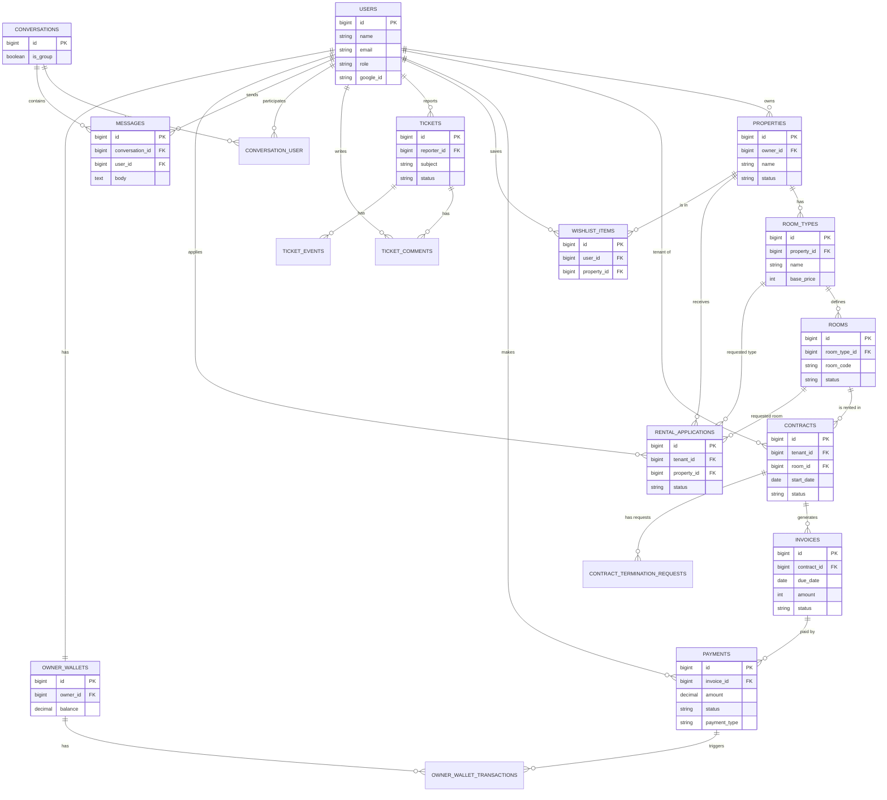

# Skema Database (Database Schema)

Dokumen ini menjelaskan struktur database aplikasi Kostin secara rinci, mencakup seluruh tabel yang ada dalam sistem.

## Diagram Relasi Entitas (ERD)

Berikut adalah visualisasi hubungan antar tabel utama dalam database Kostin.

---

## 1. Otentikasi & Pengguna (Auth & Users)

### `users`
Tabel utama untuk menyimpan data pengguna aplikasi.
| Kolom | Tipe Data | Deskripsi |
|-------|-----------|-----------|
| `id` | BIGINT (PK) | Primary Key. |
| `name` | VARCHAR | Nama lengkap pengguna. |
| `email` | VARCHAR | Alamat email (Unik). |
| `phone` | VARCHAR | Nomor telepon (Opsional). |
| `role` | ENUM | Peran: `'admin'`, `'owner'`, `'tenant'`. Default: `'tenant'`. |
| `email_verified_at` | TIMESTAMP | Waktu verifikasi email. |
| `password` | VARCHAR | Password terenkripsi (Bcrypt). |
| `google_id` | VARCHAR | ID akun Google (jika login via Google). |
| `suspended_at` | TIMESTAMP | Waktu pengguna diblokir (jika ada). |
| `remember_token` | VARCHAR | Token "Remember Me". |
| `created_at`, `updated_at` | TIMESTAMP | Waktu pembuatan dan pembaruan data. |

### `password_reset_tokens`
Menyimpan token untuk fitur lupa password.
| Kolom | Tipe Data | Deskripsi |
|-------|-----------|-----------|
| `email` | VARCHAR (PK) | Email pengguna. |
| `token` | VARCHAR | Token verifikasi. |
| `created_at` | TIMESTAMP | Waktu pembuatan token. |

### `sessions`
Menyimpan sesi pengguna aktif.
| Kolom | Tipe Data | Deskripsi |
|-------|-----------|-----------|
| `id` | VARCHAR (PK) | ID Sesi. |
| `user_id` | BIGINT | ID User pemilik sesi. |
| `ip_address` | VARCHAR | Alamat IP pengguna. |
| `user_agent` | TEXT | User agent browser. |
| `payload` | LONGTEXT | Data sesi. |
| `last_activity` | INTEGER | Timestamp aktivitas terakhir. |

---

## 2. Manajemen Properti (Property Management)

### `properties`
Menyimpan data rumah kost.
| Kolom | Tipe Data | Relasi | Deskripsi |
|-------|-----------|--------|-----------|
| `id` | BIGINT (PK) | - | Primary Key. |
| `owner_id` | BIGINT | `users.id` | Pemilik kost. |
| `name` | VARCHAR | - | Nama kost. |
| `address` | VARCHAR | - | Alamat lengkap. |
| `lat`, `lng` | DECIMAL | - | Koordinat lokasi. |
| `rules_text` | TEXT | - | Peraturan kost. |
| `photos` | JSON | - | Array URL foto-foto kost. |
| `status` | ENUM | - | `'draft'`, `'pending'`, `'approved'`, `'rejected'`. |
| `moderation_notes` | TEXT | - | Catatan moderasi dari admin. |
| `moderated_by` | BIGINT | `users.id` | Admin yang memoderasi. |
| `moderated_at` | TIMESTAMP | - | Waktu moderasi. |

### `room_types`
Kategori atau tipe kamar dalam properti.
| Kolom | Tipe Data | Relasi | Deskripsi |
|-------|-----------|--------|-----------|
| `id` | BIGINT (PK) | - | Primary Key. |
| `property_id` | BIGINT | `properties.id` | Kost induk. |
| `name` | VARCHAR | - | Nama tipe kamar. |
| `description` | TEXT | - | Deskripsi tipe kamar. |
| `area_m2` | INT UNSIGNED | - | Luas kamar (m²). |
| `bathroom_type` | ENUM | - | `'inside'`, `'outside'`. |
| `base_price` | INT UNSIGNED | - | Harga sewa dasar. |
| `deposit` | INT UNSIGNED | - | Uang jaminan (deposit). |
| `facilities_json` | JSON | - | Daftar fasilitas kamar. |

### `rooms`
Unit kamar fisik yang spesifik.
| Kolom | Tipe Data | Relasi | Deskripsi |
|-------|-----------|--------|-----------|
| `id` | BIGINT (PK) | - | Primary Key. |
| `room_type_id` | BIGINT | `room_types.id` | Tipe kamar. |
| `room_code` | VARCHAR | - | Nomor/Kode kamar (misal: "A101"). |
| `custom_price` | INT UNSIGNED | - | Harga khusus (jika berbeda dari tipe). |
| `status` | ENUM | - | `'available'`, `'occupied'`, `'maintenance'`. |
| `description` | TEXT | - | Deskripsi khusus kamar. |
| `photos_json` | JSON | - | Foto khusus kamar ini. |
| `facilities_override_json` | JSON | - | Fasilitas khusus (override tipe). |

### `wishlist_items`
Daftar kost favorit pengguna.
| Kolom | Tipe Data | Relasi | Deskripsi |
|-------|-----------|--------|-----------|
| `id` | BIGINT (PK) | - | Primary Key. |
| `user_id` | BIGINT | `users.id` | Pengguna. |
| `property_id` | BIGINT | `properties.id` | Properti favorit. |

---

## 3. Penyewaan (Tenancy)

### `rental_applications`
Permohonan sewa dari calon penyewa.
| Kolom | Tipe Data | Relasi | Deskripsi |
|-------|-----------|--------|-----------|
| `id` | BIGINT (PK) | - | Primary Key. |
| `tenant_id` | BIGINT | `users.id` | Pemohon. |
| `property_id` | BIGINT | `properties.id` | Properti tujuan. |
| `room_type_id` | BIGINT | `room_types.id` | Tipe kamar yang diinginkan. |
| `room_id` | BIGINT | `rooms.id` | Kamar spesifik (opsional). |
| `preferred_start_date` | DATE | - | Tanggal mulai yang diinginkan. |
| `duration_months` | INT UNSIGNED | - | Durasi sewa (bulan). |
| `occupants_count` | TINYINT | - | Jumlah penghuni. |
| `status` | VARCHAR | - | `'pending'`, `'approved'`, `'rejected'`, `'cancelled'`. |
| `tenant_notes` | TEXT | - | Catatan dari penyewa. |
| `owner_notes` | TEXT | - | Catatan dari pemilik. |
| `approved_at`, `rejected_at` | TIMESTAMP | - | Waktu persetujuan/penolakan. |
| `terms_text` | TEXT | - | Syarat & Ketentuan sewa. |
| `terms_accepted_at` | TIMESTAMP | - | Waktu penyewa menyetujui S&K. |
| Data Profil Tambahan | | | `contact_phone`, `contact_email`, `budget_per_month`, `employment_status`, `company_name`, `job_title`, `monthly_income`, `has_vehicle`, `vehicle_notes`, `emergency_contact_name`, `emergency_contact_phone`. |

### `contracts`
Perjanjian sewa aktif antara pemilik dan penyewa.
| Kolom | Tipe Data | Relasi | Deskripsi |
|-------|-----------|--------|-----------|
| `id` | BIGINT (PK) | - | Primary Key. |
| `tenant_id` | BIGINT | `users.id` | Penyewa. |
| `room_id` | BIGINT | `rooms.id` | Kamar yang disewa. |
| `start_date` | DATE | - | Tanggal mulai sewa. |
| `end_date` | DATE | - | Tanggal berakhir sewa. |
| `price_per_month` | INT UNSIGNED | - | Harga sewa per bulan. |
| `billing_day` | TINYINT | - | Tanggal penagihan bulanan. |
| `deposit_amount` | INT UNSIGNED | - | Jumlah deposit. |
| `status` | ENUM | - | `'draft'`, `'submitted'`, `'active'`, `'pending_renewal'`, `'terminated'`, `'canceled'`, `'expired'`. |
| `submitted_at` | TIMESTAMP | - | Waktu kontrak diajukan. |
| `activated_at` | TIMESTAMP | - | Waktu kontrak aktif. |
| `terminated_at` | TIMESTAMP | - | Waktu kontrak dihentikan. |
| `termination_reason` | TEXT | - | Alasan penghentian kontrak. |

### `contract_termination_requests`
Permohonan pemutusan kontrak lebih awal oleh penyewa.
| Kolom | Tipe Data | Relasi | Deskripsi |
|-------|-----------|--------|-----------|
| `id` | BIGINT (PK) | - | Primary Key. |
| `contract_id` | BIGINT | `contracts.id` | Kontrak terkait. |
| `tenant_id` | BIGINT | `users.id` | Pemohon. |
| `requested_end_date` | DATE | - | Tanggal berhenti yang diminta. |
| `reason` | TEXT | - | Alasan berhenti sewa. |
| `status` | ENUM | - | `'pending'`, `'approved'`, `'rejected'`. |
| `owner_notes` | TEXT | - | Catatan dari pemilik. |
| `resolved_at` | TIMESTAMP | - | Waktu permohonan diproses. |

---

## 4. Keuangan (Finance)

### `invoices`
Tagihan sewa bulanan.
| Kolom | Tipe Data | Relasi | Deskripsi |
|-------|-----------|--------|-----------|
| `id` | BIGINT (PK) | - | Primary Key. |
| `contract_id` | BIGINT | `contracts.id` | Kontrak terkait. |
| `period_month`, `period_year` | SMALLINT | - | Periode tagihan. |
| `due_date` | DATE | - | Tanggal jatuh tempo. |
| `amount` | INT UNSIGNED | - | Jumlah tagihan utama. |
| `late_fee` | INT UNSIGNED | - | Denda keterlambatan. |
| `total` | INT UNSIGNED | - | Total yang harus dibayar. |
| `status` | ENUM | - | `'unpaid'`, `'paid'`, `'overdue'`, `'canceled'`, `'pending_verification'`, `'expired'`. |
| `status_reason` | TEXT | - | Alasan status (misal: pembatalan). |
| `qris_payload` | JSON | - | Data QRIS untuk pembayaran. |
| `paid_at` | TIMESTAMP | - | Waktu pembayaran lunas. |

### `payments`
Transaksi pembayaran untuk tagihan.
| Kolom | Tipe Data | Relasi | Deskripsi |
|-------|-----------|--------|-----------|
| `id` | BIGINT (PK) | - | Primary Key. |
| `invoice_id` | BIGINT | `invoices.id` | Tagihan yang dibayar. |
| `user_id` | BIGINT | `users.id` | Pembayar. |
| `submitted_by` | BIGINT | `users.id` | Pengirim bukti (untuk manual). |
| `amount` | DECIMAL | - | Jumlah yang dibayarkan. |
| `payment_type` | ENUM | - | `'qris'`, `'manual_bank_transfer'`, `'manual_cash'`. |
| `status` | ENUM | - | `'pending'`, `'waiting_verification'`, `'success'`, `'failed'`, `'rejected'`. |
| `midtrans_order_id` | VARCHAR | - | ID Order Midtrans. |
| `transaction_status` | VARCHAR | - | Status dari Midtrans. |
| `proof_path` | VARCHAR | - | Path file bukti transfer. |
| `verified_by` | BIGINT | `users.id` | Admin/Owner yang memverifikasi. |
| `verified_at` | TIMESTAMP | - | Waktu verifikasi. |
| `rejection_reason` | TEXT | - | Alasan penolakan pembayaran. |

### `owner_wallets`
Dompet digital pemilik kost untuk menampung pendapatan.
| Kolom | Tipe Data | Relasi | Deskripsi |
|-------|-----------|--------|-----------|
| `id` | BIGINT (PK) | - | Primary Key. |
| `owner_id` | BIGINT | `users.id` | Pemilik dompet. |
| `balance` | DECIMAL | - | Saldo saat ini. |

### `owner_wallet_transactions`
Riwayat transaksi (mutasi) pada dompet pemilik.
| Kolom | Tipe Data | Relasi | Deskripsi |
|-------|-----------|--------|-----------|
| `id` | BIGINT (PK) | - | Primary Key. |
| `owner_wallet_id` | BIGINT | `owner_wallets.id` | Dompet terkait. |
| `payment_id` | BIGINT | `payments.id` | Pembayaran terkait (sumber dana). |
| `type` | ENUM | - | `'credit'` (Masuk), `'debit'` (Keluar). |
| `amount` | DECIMAL | - | Jumlah dana. |
| `description` | VARCHAR | - | Keterangan transaksi. |

---

## 5. Dukungan & Komunikasi (Support & Communication)

### `tickets`
Tiket bantuan atau laporan masalah.
| Kolom | Tipe Data | Relasi | Deskripsi |
|-------|-----------|--------|-----------|
| `id` | BIGINT (PK) | - | Primary Key. |
| `ticket_code` | VARCHAR | - | Kode unik tiket. |
| `reporter_id` | BIGINT | `users.id` | Pelapor. |
| `assignee_id` | BIGINT | `users.id` | Staf yang menangani. |
| `subject` | VARCHAR | - | Judul tiket. |
| `description` | TEXT | - | Deskripsi masalah. |
| `category` | ENUM | - | `'technical'`, `'payment'`, `'content'`, `'abuse'`. |
| `priority` | ENUM | - | `'low'`, `'medium'`, `'high'`, `'urgent'`. |
| `status` | ENUM | - | `'open'`, `'in_review'`, `'escalated'`, `'resolved'`, `'rejected'`. |
| `related_type`, `related_id` | MORPH | - | Relasi polimorfik ke objek lain (misal: Property). |

### `ticket_comments`
Komentar atau balasan pada tiket.
| Kolom | Tipe Data | Relasi | Deskripsi |
|-------|-----------|--------|-----------|
| `id` | BIGINT (PK) | - | Primary Key. |
| `ticket_id` | BIGINT | `tickets.id` | Tiket terkait. |
| `user_id` | BIGINT | `users.id` | Penulis komentar. |
| `body` | TEXT | - | Isi komentar. |
| `attachments` | JSON | - | Lampiran file. |

### `ticket_events`
Log aktivitas perubahan pada tiket (Audit Trail).
| Kolom | Tipe Data | Relasi | Deskripsi |
|-------|-----------|--------|-----------|
| `id` | BIGINT (PK) | - | Primary Key. |
| `ticket_id` | BIGINT | `tickets.id` | Tiket terkait. |
| `user_id` | BIGINT | `users.id` | Pelaku aksi. |
| `event_type` | ENUM | - | Jenis event (e.g., `'status_changed'`, `'assigned'`). |
| `payload` | JSON | - | Data detail event. |

### `conversations`
Ruang percakapan chat.
| Kolom | Tipe Data | Deskripsi |
|-------|-----------|-----------|
| `id` | BIGINT (PK) | Primary Key. |
| `title` | VARCHAR | Judul percakapan (opsional). |
| `is_group` | BOOLEAN | Apakah grup chat? |
| `metadata` | JSON | Metadata tambahan. |

### `conversation_user`
Tabel pivot peserta percakapan.
| Kolom | Tipe Data | Relasi | Deskripsi |
|-------|-----------|--------|-----------|
| `id` | BIGINT (PK) | - | Primary Key. |
| `conversation_id` | BIGINT | `conversations.id` | Percakapan. |
| `user_id` | BIGINT | `users.id` | Peserta. |
| `last_read_at` | TIMESTAMP | - | Waktu terakhir membaca pesan. |
| `role` | VARCHAR | - | Peran dalam grup (opsional). |

### `messages`
Pesan dalam percakapan.
| Kolom | Tipe Data | Relasi | Deskripsi |
|-------|-----------|--------|-----------|
| `id` | BIGINT (PK) | - | Primary Key. |
| `conversation_id` | BIGINT | `conversations.id` | Percakapan. |
| `user_id` | BIGINT | `users.id` | Pengirim. |
| `body` | TEXT | - | Isi pesan. |
| `attachments` | JSON | - | Lampiran file. |
| `read_at` | TIMESTAMP | - | Waktu dibaca (untuk 1-on-1). |

