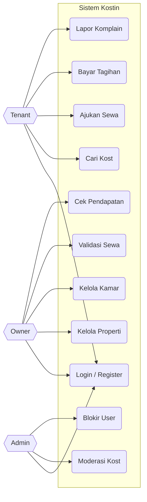
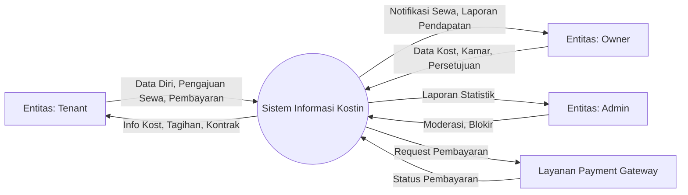
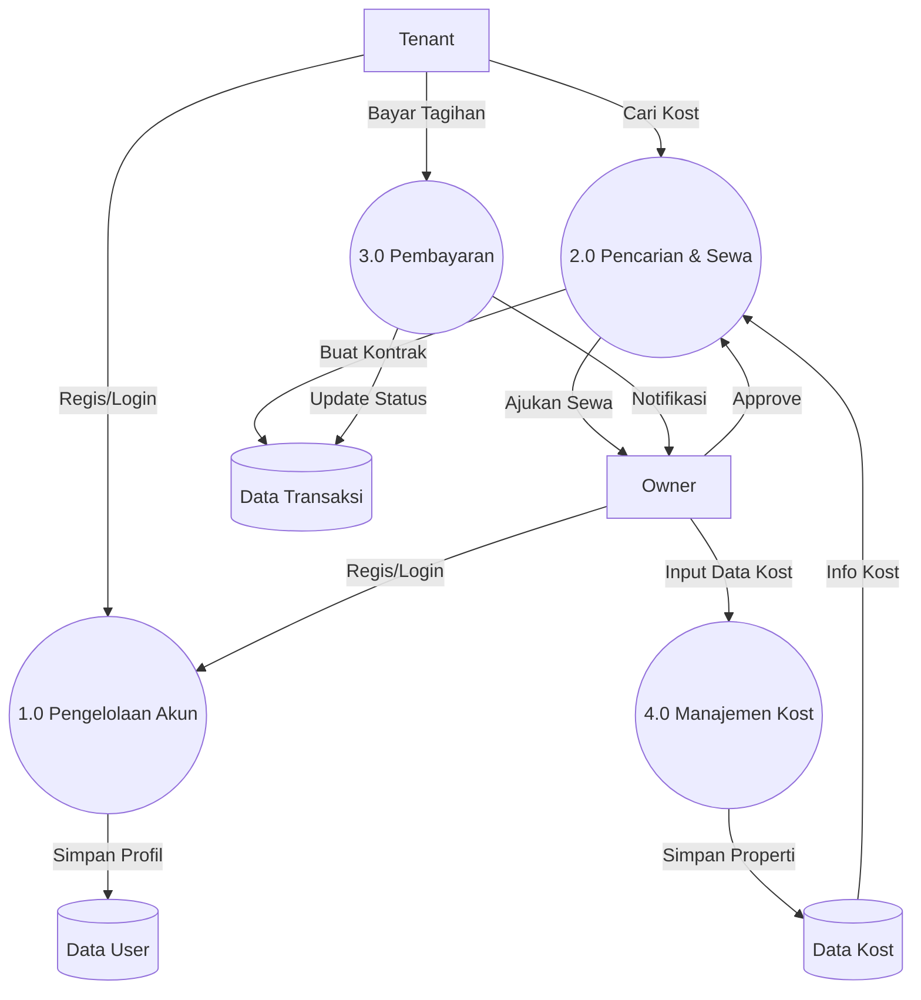
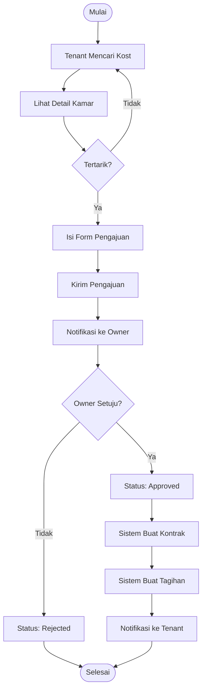
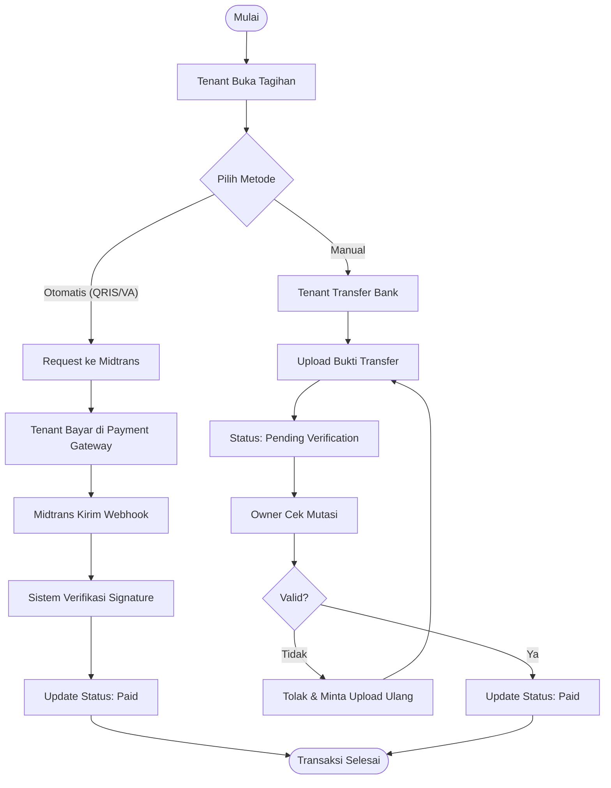

# Diagram Sistem (System Diagrams)

Dokumen ini berisi visualisasi alur dan proses sistem Kostin menggunakan diagram standar.

---

## 1. Use Case Diagram

Menggambarkan interaksi antara pengguna (Aktor) dengan fitur-fitur sistem.

---

## 2. Data Flow Diagram (DFD)

### DFD Level 0 (Context Diagram)
Gambaran umum aliran data antara entitas luar dan sistem.

### DFD Level 1 (Proses Utama)
Pecahan proses yang lebih detail.

---

## 3. Flowchart (Alur Proses)

### Alur Penyewaan Kamar (Rental Process)

### Alur Pembayaran (Payment Process)

